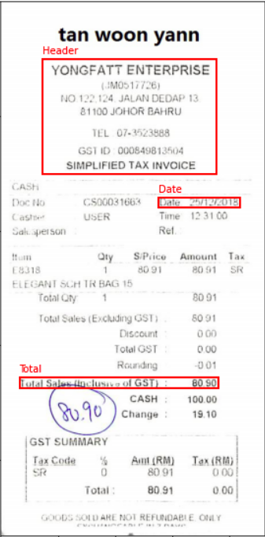
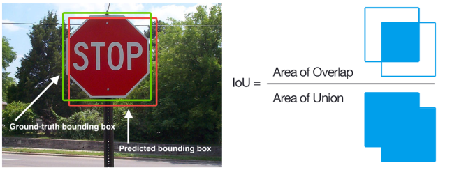
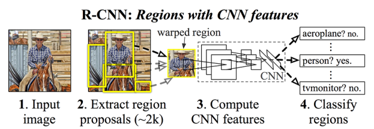
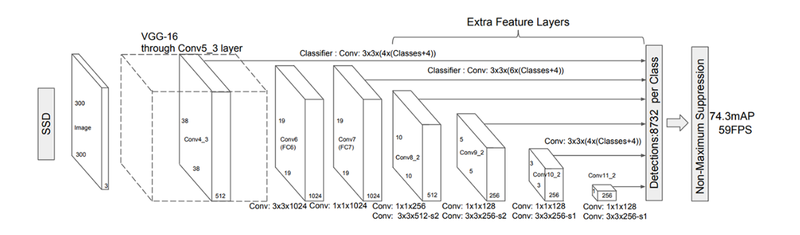

# Extracting Information from scanned invoices

## The problem

Extracting key texts from receipts and invoices and save the texts to structured documents can serve many applications and services such as:
- Efficient archiving
- Fast indexing and
- Document analytics

Information extraction play critical roles in streamlining document-intensive processes and office automation in many financial, accounting and taxation areas.

Specifically, we are going to extract the header, date and total sections (without the text).

## Dataset
- We used an receipt dataset available [here](https://rrc.cvc.uab.es/?ch=13). The dataset has 600 scanned receipt images in the training set.

## How do we annotate the dataset
- We used [VGG Image Annotator (VIA)](http://www.robots.ox.ac.uk/~vgg/software/via/) as our annotation tool
- We manually labeled the 600 scanned receipts. It took approximately **16 hours** of one of us

## Technical Problem
Our goal is to handle the problem as an object detection task where we want to exract three parts:

- The header of the invoice where there is the company name
- The total of the invoice
- The date of the invoice

## Evaluation metric

For performance evaluation we used a combination of two metrics:
- **IoU (Intersection Over Union)**:
  * With this metric we want to ensure
that our predicted bounding boxes match as closely as possible the ground truth bounding boxes. An IoU score > 0.5 is normally considered a “good” prediction.
- **mAP (mean Average Precision)**.
  * Compute the **precision**, The precision allows us to measure the how good of a job we did predicting the location and label of an object.
  * Compute the **recall**, Recall measures how good of a job we did finding and locating all objects.
  * Average together the maximum precision value across all recall levels in steps of size s

  ## Experiments

- We experiment with two differnet architectures
  * **Faster RCNN (Faster Region Based Convolutional Neural Network)**: We used a pretarined network on COCO dataset. The pretrained can be found in the Tensorflow zoo. Specifically we used the [faster_rcnn_resnet101_coco](https://github.com/tensorflow/models/blob/master/research/object_detection/g3doc/detection_model_zoo.md). We performed finetunnning for 20.000 training steps in approx 5 hours using a GPU p2.xlarge in AWS
  * **SSD (Single shot detector)**: We used a pretrained network on COCO dataset. The pretrained can be found in the Tensorflow zoo. Specifically we used the [ssd_inception_v2_coco](https://github.com/tensorflow/models/blob/master/research/object_detection/g3doc/detection_model_zoo.md). We performed finetunnning for 20.000 training steps in approx 7 hours with a p2.x8large in AWS

- Why SSD+Inception and RCNN+Resnet?: In object detection we have mainly two componets
  * A base network used for classification, like Inception or Resnet
  * An approach to perform object detection like RCNN or SSD. The way you do this is by taking the base network and perform some kind of surgery to make the network work of Object Detection

  ### RCNN
  
- Step #1: Input an image to the network.
- Step #2: Extract region proposals (i.e., regions of an image that potentially contain objects) using some algorithm.
- Step #3: Use a CNN to compute features for each proposal.
- Step #4: Classify each proposal using the extracted features with a classifier.

### SSD (Single Shot Detector)

These are the two main characteristics:

- Both localization and detection are performed in a single forward pass
- The network is fully-convolutional

## Training the models

Please refer to notebook [train.ipynb](train.ipynb) for training these two models usign the Tensorflow Object Detection API with the invoices dataset

## Making predictions

If you want to make predictions, please refer to the notebook [predict.ipynb](predict.ipynb) where you can use a pretrained model to make predictions on new images

## Results and conclusion
Having into account that a good loss is one that is below 1.5,we achieved the following results:

* Faster RCNN:
  - Loss:  0.08227948.
  - mAP: 0.86607015

* SSD:
    - Loss: 5.660365
    - mAP: 0.47784725

This difference is explained because
- Faster RCNN is slower (maybe not suitable for real time object detection) but is in general with better detections
- SSD is faster and hence is possible to perform real time object detection but at a cost of worse detections

SSD is not good at least the way we trained it, more experimentation wowuld be nice adjusting hyperparamters

You can do a comparison with results obtained for this dataset in [this site](https://rrc.cvc.uab.es/?ch=13&com=evaluation&task=1)
